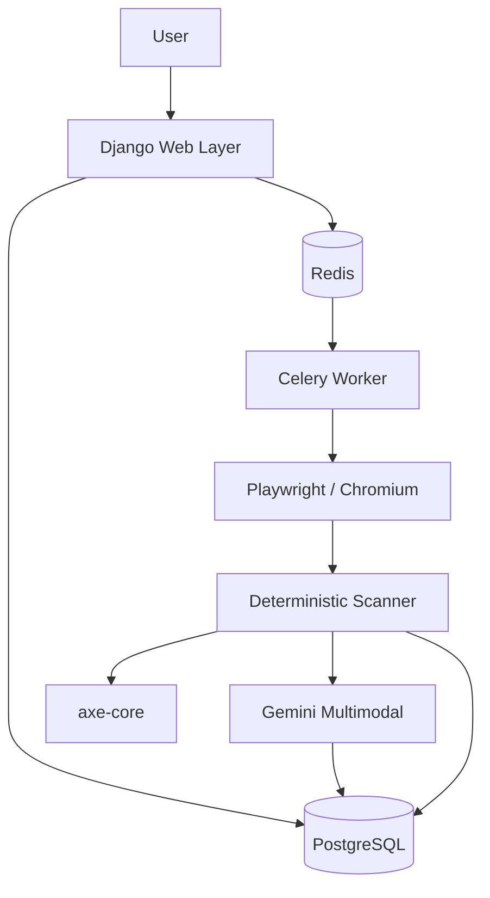

# AI Web Doctor

Find broken UI before your users do.

AI Web Doctor scans real websites using a real browser (Playwright + Chromium), detects
responsive and accessibility problems with **deterministic measurements**, uses multimodal
**AI for visual/UX reasoning**, generates developer-friendly **fix suggestions**, and
objectively **verifies** whether a fix actually solved the detected problem.

> Everything meaningful about a problem is verified by deterministic re-measurement, not
> by asking an AI whether it is fixed.

---

## Badges

[](https://www.python.org/)
[](https://www.djangoproject.com/)
[](LICENSE)
[](https://github.com/YOUR_GITHUB_USERNAME/ai_web_doctor/actions)
[](docker-compose.yml)

> Replace `YOUR_GITHUB_USERNAME` in the Build badge with the real repository owner.
> The build badge is only meaningful after the `ci.yml` workflow runs on GitHub.

---

## Workflow

```
URL
↓
Security Validation (SSRF guard)
↓
Celery (background queue)
↓
Playwright (real Chromium)
↓
Screenshots + DOM Metrics
↓
Deterministic Analysis
↓
axe-core (accessibility)
↓
Gemini Vision Analysis
↓
Issue Normalization
↓
UI Health Score
↓
Developer Fix
↓
Verify Fix
```

### Design principle

- **Deterministic checks** establish measurable facts: overflow in pixels, elements outside
  the viewport, broken images, axe violations.
- **AI is used for visual/UX reasoning only** — it reads the screenshots and explains *why*
  something looks off and *how* to fix it. AI never reports measurements, and AI failures
  never break the scan.
- **Fix verification is objective**: after a developer applies a suggested fix, the same
  deterministic check that flagged the problem is re-run, producing `verified` /
  `improved` / `failed` with before/after screenshots.

## Status

This is a working, tested implementation. Be aware of what is and is not finished:

| Area | Status |
|---|---|
| Multi-viewport deterministic scanning | Implemented |
| axe-core accessibility pass | Implemented |
| Gemini visual analysis + fix suggestions | Implemented |
| Fix verification (re-measure) | Implemented |
| Rate limiting + resource limits | Implemented |
| SSRF guard / DNS rebinding protection | Implemented |
| Structured JSON logging | Implemented |
| Django admin / accounts / results UI | Implemented |
| Celery background queue | Implemented (dev mode also runs scans in-process) |
| Reports app (downloads / health score reports) | **Planned** (empty placeholder app) |
| REST API beyond health endpoint | **Planned** (currently only `/api/health/`) |
| Deployed public demo | **Not available** |
| CI pipeline | Configured (`.github/workflows/ci.yml` — tests + frontend build) |

## Features

### Real browser scanning

Scans run in a real headless **Chromium** browser driven by **Playwright** — pages are
loaded, network is allowed to idle, and the page is measured as a real user would see it.
Not a DOM-only lint.

### Multi-viewport testing

Each scan runs across 9 viewports (configurable via `SCAN_VIEWPORTS`):

| Viewport |
|---|
| 320 × 800 |
| 375 × 812 |
| 390 × 844 |
| 414 × 896 |
| 600 × 960 |
| 768 × 1024 |
| 834 × 1112 |
| 1024 × 1366 |
| 1440 × 900 |

### Responsive analysis

Deterministic per-viewport checks:

- **Horizontal overflow** — content wider than the viewport (measured in pixels)
- **Elements outside viewport** — positioned/rendered beyond the visible area
- **Text overflow** — text clipped or spilling out of its container
- **Navigation problems** — unusable or clipped navigation at narrow widths
- **Image problems** — broken images, missing `alt` text
- **Layout problems** — overlapping/off-screen elements

### Accessibility analysis

An **axe-core** pass runs per viewport (injected via CDN with graceful degradation when the
page blocks third-party scripts). Violations become issues in the report with severity,
impact, and selector evidence.

### AI visual analysis

Optional **Gemini multimodal** analysis reads representative screenshots plus the
deterministic findings and adds visual/UX reasoning: hierarchy, spacing, alignment,
typography, CTA visibility, responsive behavior. The model is constrained to a strict
structured-output schema and its findings are normalized and merged (deduplicated) with
deterministic issues. Runs only when `AI_ENABLED` and a valid `GEMINI_API_KEY` are set;
the product degrades gracefully without them.

### Developer fixes

For any issue, a developer can request a code fix. Gemini returns a focused snippet
(`CSS` / `HTML` / `JavaScript` / `JSX`) with an explanation and the recommended change.
Fixes are **suggestions only** — never executed or auto-applied.

### Verify Fix

After applying a fix, re-run the exact deterministic check that flagged the issue:

- `verified` — the measurement is gone (e.g. overflow 42px → 0px)
- `improved` — the measurement shrank but the problem remains
- `failed` — unchanged or worse

Before/after screenshots are stored alongside the verdict.

### Security

- **SSRF guard** — target hosts are validated; localhost, RFC1918/private, link-local, and
  cloud-metadata addresses are rejected, with DNS-rebinding re-validation after resolution.
- **Resource limits** — max scan duration, concurrent scans, redirects, response size,
  screenshot bytes, and AI payload bytes, all configurable.
- **Rate limiting** — daily scan quotas per IP (anonymous vs. logged-in).
- **Hardened settings** — secure cookies/HSTS in production, friendly error pages with no
  stack traces, and `manage.py check --deploy` passes clean.
- **Secrets** — the Gemini key travels in an `x-goog-api-key` header, never in URLs or logs.

## Screenshots

<!-- Add landing page screenshot here -->

<!-- Add results dashboard screenshot here -->

<!-- Add issue detail + fix + verify screenshot here -->

Screenshots will live in `docs/screenshots/` as the UI stabilizes. None are claimed yet.

## Demo

> A public demo is not currently available.

To try it yourself, follow [Quick start](#quick-start) below — it runs fully locally.

## Architecture

```
┌────────────┐   POST /scans/   ┌──────────────────┐   dispatch   ┌─────────────────────┐
│  Browser   │ ───────────────► │ Django web layer │ ───────────► │ scan executor        │
│  (UI)      │                  │ rate limit,      │              │ Playwright 9 vw      │
└────────────┘                  │ concurrency cap  │              │ responsive + axe     │
                                └──────────────────┘              │ screenshots + AI     │
                                                                  └─────────────────────┘
                                      │                                   │
                                      ▼                                   ▼
                                 PostgreSQL                       Redis / Celery
                              (scans, issues,                    (broker for the
                               verifications)                    background queue)
```



| Component | Responsibility |
|---|---|
| **Browser (UI)** | Landing page with scan form, live progress, results dashboard, issue detail + fix + verify |
| **Django** | Web layer: auth, rate limiting, concurrency cap, views, API, admin |
| **PostgreSQL** | Scans, screenshots metadata, page metrics, issues, verifications |
| **Redis** | Celery broker + result backend |
| **Celery** | Background scan execution (in-process eager thread in dev mode) |
| **Playwright** | Real Chromium page lifecycle, 9-viewport engine, screenshots |
| **Deterministic scanner** | Overflow/outside-viewport/navigation/image/layout checks with pixel evidence |
| **axe-core** | Accessibility rule pass per viewport |
| **Gemini** | Multimodal visual/UX analysis + fix generation, schema-constrained |

Key modules (`scanner/`):

- `security.py` — SSRF guard: host validation, DNS-rebinding re-check, private-IP blocking
- `browser.py` — Playwright page lifecycle, viewport engine, screenshot bytes
- `analyzer.py` — per-viewport orchestration (metrics + findings + screenshot)
- `responsive.py` — overflow / outside-viewport checks
- `accessibility.py` — axe pass with safe chunking
- `screenshots.py` — PNG encoding + downscaling
- `dom.py` / `findings.py` — DOM snapshotting and finding model

## Tech stack

| Layer | Technology |
|---|---|
| Backend | Python 3.12+ · Django 5.2 LTS · Django REST Framework |
| Data | PostgreSQL · Redis |
| Async | Celery |
| Browser | Playwright · Chromium |
| Accessibility | axe-core |
| AI | Gemini multimodal API |
| Frontend | Tailwind CSS · HTMX · Alpine.js · Lucide Icons · Chart.js |
| Packaging | Docker · Docker Compose · GitHub Actions |

## Quick start

Requirements: Python 3.12+, PostgreSQL 16, Node.js (for the Tailwind bundle), and for full
scans Playwright's Chromium (`playwright install chromium`).

```bash
git clone YOUR_REPOSITORY_URL
cd ai_web_doctor

python3 -m venv .venv && source .venv/bin/activate
pip install -r requirements/development.txt

npm install
npm run build                 # regenerate static/css/site.css

createdb ai_web_doctor
cp .env.example .env          # edit DATABASE_URL, SECRET_KEY, GEMINI_API_KEY

python manage.py migrate
python manage.py createsuperuser
python manage.py runserver
```

Visit http://127.0.0.1:8000 — the landing page has a scan form. Paste a **public** URL
(local/private hosts are blocked by the SSRF guard).

> `scanner/security.py` refuses localhost / RFC1918 / metadata addresses, so local pages
> cannot be scanned from the web flow. Use live public URLs, or exercise the scanner
> directly from a shell for local development.

### Celery (optional background queue)

By default (`.env` `CELERY_TASK_ALWAYS_EAGER=True`) scans run in-process for development.
For a real queue:

```bash
redis-server
celery -A config.celery worker --loglevel=info
# then set CELERY_TASK_ALWAYS_EAGER=False in .env
```

### Docker

```bash
docker compose up --build        # db, redis, web, worker
docker compose exec web python manage.py createsuperuser
```

## Environment variables

See `.env.example` for the full annotated list. Highlights:

| Variable | Default | Purpose |
|---|---|---|
| `DATABASE_URL` | — | PostgreSQL DSN |
| `SECRET_KEY` | `change-me-in-production` | Django secret (≥50 chars in prod) |
| `GEMINI_API_KEY` | empty | Gemini API key (AI analysis is optional) |
| `GEMINI_MODEL` | `gemini-2.0-flash` | Model used for analysis/fixes |
| `AI_ENABLED` | `True` | Master switch for AI features |
| `MAX_SCAN_DURATION` | `120` | Seconds before a scan skips AI and wraps up |
| `MAX_CONCURRENT_SCANS` | `2` | Concurrent in-flight scans |
| `MAX_REDIRECTS` | `5` | Redirect budget during navigation |
| `MAX_RESPONSE_SIZE` | `5242880` | Bytes of response body downloaded |
| `MAX_SCREENSHOTS` | `16` | Screenshots stored per scan |
| `MAX_SCREENSHOT_SIZE` | `8388608` | Max JPEG bytes (oversized shots are downscaled) |
| `MAX_AI_REQUEST_SIZE` | `4194304` | Max prompt payload to the AI |
| `SCAN_NETWORK_IDLE_TIMEOUT_MS` | `2000` | Bounded idle wait per viewport (was 10000) |
| `CHROMIUM_LOW_MEMORY_MODE` | `True` | Capped V8 heaps + no background services (fits ~200MB hosts) |
| `SCAN_BLOCK_HEAVY_RESOURCES` | `True` | Abort fonts/media/tracker requests during scans |
| `SCAN_SUBPROCESS_MODE` | `False` | Run scans in a short-lived subprocess (recommended in production) |
| `RATE_LIMIT_ANONYMOUS_SCANS_PER_DAY` | `3` | Daily quota per IP (anonymous) |
| `RATE_LIMIT_AUTHED_SCANS_PER_DAY` | `10` | Daily quota per IP (logged in) |
| `TRUST_X_FORWARDED_FOR` | `False` | Only `True` behind a trusted reverse proxy |
| `LOG_LEVEL` | `INFO` | Root log level |

## Testing

```bash
python manage.py test            # full suite (deterministic checks, security, verify, AI…)
python manage.py check --deploy  # deployment checks (production settings)
```

The suite runs headless and does not require a browser for most tests; verification and
scanning tests mock the browser layer.

## Logging

Structured JSON lines via `config.logging_config.log_event(...)` — lifecycle events such
as `scan.dispatched`, `scan.completed` (with `duration_ms`), `verification.completed`
(`old_value`/`new_value`), `ai.error`. Filter with any JSON-aware tool:

```bash
jq 'select(.message=="scan.completed")' app.log
```

## Project layout

```
ai_web_doctor/
├── apps/
│   ├── accounts/      # register / login (django.contrib.auth)
│   ├── scans/         # Scan model, views, dispatch, rate limiting, API
│   ├── ai/            # Gemini provider, prompts, payload sizing, fix generation
│   ├── issues/        # Issue + Verification models, verify/fix services
│   └── reports/       # report download/generation (planned)
├── config/
│   ├── settings/      # base.py / development.py / production.py
│   └── logging_config.py   # JSON formatter + log_event() helper
├── scanner/           # headless scanning engine
├── templates/         # Django templates (Tailwind + Alpine + htmx)
├── static/
│   ├── src/input.css  # Tailwind source (rebuild with npm run build)
│   └── vendor/        # alpine.js, htmx
├── tests/             # Django test suite
└── requirements/
```

## URLs

| Route | Description |
|---|---|
| `/` | Landing page + scan form |
| `/scans/` | Your recent scans |
| `/scans/<id>/` | Scan detail + live progress |
| `/scans/<id>/results/` | Findings dashboard (severity + category breakdown) |
| `/scans/<id>/issues/<iid>/` | Issue detail, fix suggestion, Verify Fix |
| `/accounts/` | Register / login |
| `/api/health/` | Health check |
| `/admin/` | Django admin |

## Roadmap

Planned (not yet implemented):

- Report downloads and health-score history (`apps/reports` is an empty placeholder)
- REST API for scans/issues beyond the health endpoint
- Public demo deployment
- Production deployment automation (CI currently covers tests + frontend build)

## Contributing

Contributions are welcome. Please open an issue first for significant changes, keep the
deterministic-first design principle, and make sure `python manage.py test` passes.

## License

[MIT](LICENSE) © YOUR_NAME — replace with the actual copyright holder before publishing.