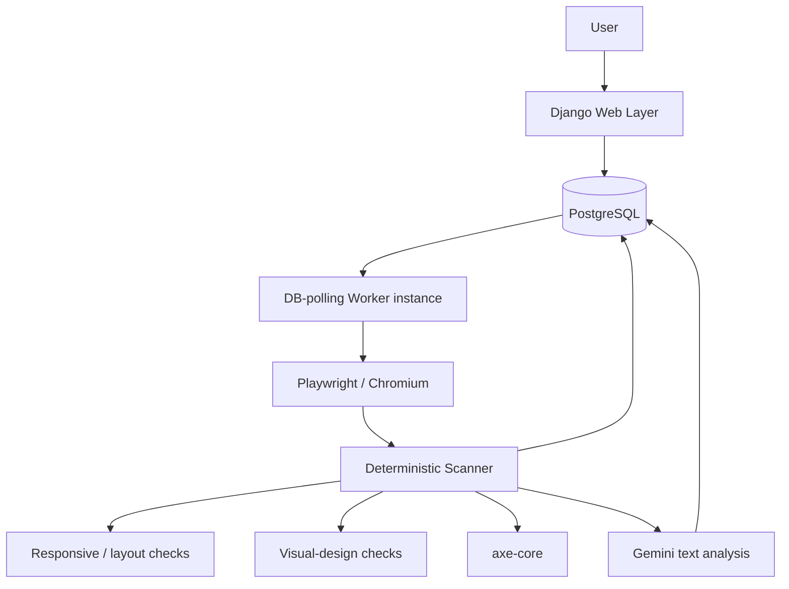

# AI Web Doctor

Find broken UI before your users do.

AI Web Doctor scans real websites using a real browser (Playwright + Chromium), detects
responsive, accessibility, typography, color, spacing, interaction, performance and UX
problems with **deterministic measurements**, uses **AI for analysis and fix suggestions**
(text-only by default, screenshots optional), and objectively **verifies** whether a fix
actually solved the detected problem.

> Everything meaningful about a problem is verified by deterministic re-measurement, not
> by asking an AI whether it is fixed.

---

## Badges

[](https://www.python.org/)
[](https://www.djangoproject.com/)
[](LICENSE)
[](https://github.com/1abhishek0948/Ai-Web-Doctor/actions)
[](docker-compose.yml)

---

## Workflow

```
URL
↓
Security Validation (SSRF guard)
↓
DB-polling worker (dedicated instance claims the scan from Postgres)
↓
Playwright (real Chromium, in-process on the worker)
↓
Screenshots + DOM Metrics
↓
Deterministic Analysis (responsive + layout + navigation)
↓
axe-core (accessibility)
↓
Visual-design checks (typography, color, spacing, interaction,
  performance, UX — all 10 categories analyzed on every scan)
↓
Gemini Analysis (text-only, token-budgeted; screenshots optional)
↓
Issue Normalization
↓
UI Health Score
↓
Developer Fix
↓
Verify Fix
```

### Design principle

- **Deterministic checks establish measurable facts**: overflow in pixels, elements outside
  the viewport, broken images, axe violations, tiny fonts, invisible text, small touch
  targets, images without dimensions, vague link labels. Every one of the ten report
  categories is analyzed by deterministic checks, so a clean card means "clean", never
  "unchecked".
- **AI is used for analysis and suggestions only** — text-only by default, it reads the
  findings and explains *why* something looks off and *how* to fix it. AI never reports
  measurements, and AI failures never break the scan.
- **Fix verification is objective**: after a developer applies a suggested fix, the same
  deterministic check that flagged the problem is re-run, producing `verified` /
  `improved` / `failed` with before/after screenshots.

## Status

This is a working, tested implementation. Be aware of what is and is not finished:

| Area | Status |
|---|---|
| Multi-viewport deterministic scanning | Implemented |
| All 10 categories analyzed deterministically (no AI required) | Implemented |
| axe-core accessibility pass | Implemented |
| Gemini text analysis + fix suggestions (images optional) | Implemented |
| Fix verification (re-measure) | Implemented |
| Rate limiting + resource limits | Implemented |
| SSRF guard / DNS rebinding protection | Implemented |
| Structured JSON logging | Implemented |
| Django admin / accounts / results UI | Implemented |
| DB-polling background worker | Implemented (dedicated worker instance runs Chromium; dev mode runs scans in-process) |
| Production deployment (Render free tier, subprocess + watchdog) | **Live** at [ai-web-doctor.onrender.com](https://ai-web-doctor.onrender.com) |
| Reports app (downloads / health score reports) | **Planned** (empty placeholder app) |
| REST API beyond health endpoint | **Planned** (currently only `/api/health/`) |
| CI pipeline | Configured (`.github/workflows/ci.yml` — tests + frontend build) |

## Features

### Real browser scanning

Scans run in a real headless **Chromium** browser driven by **Playwright** — pages are
loaded, network is allowed to idle, and the page is measured as a real user would see it.
Not a DOM-only lint. In production, Chromium runs on a dedicated worker instance (see
[Architecture](#architecture)) so an OOM or wedged renderer can never take down the web
process.

### Multi-viewport testing

Each scan runs across 9 viewports (configurable via `SCAN_VIEWPORTS`):

| Viewport |
|---|
| 320 × 800 |
| 375 × 812 |
| 390 × 844 |
| 414 × 896 |
| 600 × 960 |
| 768 × 1024 |
| 834 × 1112 |
| 1024 × 1366 |
| 1440 × 900 |

### Responsive analysis

Deterministic per-viewport checks:

- **Horizontal overflow** — content wider than the viewport (measured in pixels)
- **Elements outside viewport** — positioned/rendered beyond the visible area
- **Text overflow** — text clipped or spilling out of its container
- **Navigation problems** — unusable or clipped navigation at narrow widths
- **Image problems** — broken images, missing `alt` text
- **Layout problems** — overlapping/off-screen elements

### Visual design analysis (deterministic)

Runs once per scan at the desktop viewport; no AI involved. These checks keep the
typography, color, spacing, interaction, performance and UX categories analyzed on
**every** scan:

- **Typography** — body text smaller than 12px; pages with no coherent type scale (>14
  distinct font sizes)
- **Color** — text rendered in the same color as its background (invisible content)
- **Spacing** — same-parent siblings whose boxes overlap by more than 8px
- **Interaction** — click targets smaller than 44×44px; buttons/links without a pointer
  cursor
- **Performance** — images without `width`/`height` attributes (layout-shift risk);
  intrinsically oversized images (>2 MP)
- **UX** — vague link labels ("click here", "read more"…); links with no accessible label;
  `target="_blank"` links missing `rel="noopener"`

### Accessibility analysis

An **axe-core** pass runs per viewport (injected via CDN with graceful degradation when the
page blocks third-party scripts). Violations become issues in the report with severity,
impact, and selector evidence.

### AI analysis and fixes

Optional **Gemini** analysis reads the deterministic findings and adds reasoning:
hierarchy, spacing, alignment, typography, CTA visibility, responsive behavior.

- **Text-only by default** — `AI_SEND_IMAGES=False` keeps requests in the low thousands of
  tokens (a ~25K hard cap via `AI_MAX_PROMPT_TOKENS`); screenshots are attached only when
  explicitly enabled.
- The model is constrained to a strict structured-output schema; findings are validated
  leniently per-issue (a single bad issue is skipped, never the whole response) and merged
  (deduplicated) with deterministic issues.
- API keys travel in an `x-goog-api-key` header (with an `Authorization: Bearer` fallback
  for OAuth-style tokens) — never in URLs or logs.
- Runs only when `AI_ENABLED` and a valid `GEMINI_API_KEY` are set; the product degrades
  gracefully without them.

For any issue, a developer can request a code fix. Gemini returns a focused snippet
(`CSS` / `HTML` / `JavaScript` / `JSX`) with an explanation and the recommended change.
Fixes are **suggestions only** — never executed or auto-applied.

### Verify Fix

After applying a fix, re-run the exact deterministic check that flagged the issue:

- `verified` — the measurement is gone (e.g. overflow 42px → 0px)
- `improved` — the measurement shrank but the problem remains
- `failed` — unchanged or worse

Before/after screenshots are stored alongside the verdict.

### Security

- **SSRF guard** — target hosts are validated; localhost, RFC1918/private, link-local, and
  cloud-metadata addresses are rejected, with DNS-rebinding re-validation after resolution.
- **Resource limits** — max scan duration, concurrent scans, redirects, response size,
  screenshot bytes, and AI payload bytes, all configurable.
- **Rate limiting** — daily scan quotas per IP (anonymous vs. logged-in).
- **Hardened settings** — secure cookies/HSTS in production, friendly error pages with no
  stack traces, and `manage.py check --deploy` passes clean.
- **Memory safety** — capped V8 heaps (256MB), no background services, and CDP-based
  blocking of heavy resources (fonts/media/trackers, and images on low-memory hosts) keep
  Chromium inside Render's 512MB free plan even for media-heavy sites.

## Screenshots

<!-- Add landing page screenshot here -->

<!-- Add results dashboard screenshot here -->

<!-- Add issue detail + fix + verify screenshot here -->

Screenshots will live in `docs/screenshots/` as the UI stabilizes. None are claimed yet.

## Demo

> Public demo: **https://ai-web-doctor.onrender.com** (Render free tier — the first request
> after idle may take a minute to cold-start).

To run it yourself, follow [Quick start](#quick-start) below.

## Architecture

```
┌────────────┐   POST /scans/   ┌──────────────────┐   queue in     ┌─────────────────────────┐
│  Browser   │ ───────────────► │ Django web layer │ ─────────────► │ DB-polling worker       │
│  (UI)      │                  │ rate limit,      │   PostgreSQL   │ instance (own 512MB)    │
└────────────┘                  │ concurrency cap  │                │ Playwright 2 viewports  │
                                └──────────────────┘                │ responsive + axe       │
                                              ▲                     │ visual-design checks   │
                                              │ claims queued       │ screenshots + AI       │
                                  PostgreSQL   └─────────────────────└─────────────────────────┘
                               (scans, issues,
                                verifications)
```



| Component | Responsibility |
|---|---|
| **Browser (UI)** | Landing page with scan form, live progress, results dashboard, issue detail + fix + verify |
| **Django (web)** | Web layer: auth, rate limiting, concurrency cap, views, API, admin, scan queueing |
| **Worker** | Dedicated instance running `manage.py scan_worker`: polls Postgres, claims queued scans, executes them with Chromium in-process (free-tier memory safety, no Redis needed) |
| **PostgreSQL** | Scans, screenshots metadata, page metrics, issues, verifications — also carries the scan queue itself |
| **Playwright** | Real Chromium page lifecycle, multi-viewport engine, screenshots, CDP resource blocking |
| **Deterministic scanner** | Overflow / outside-viewport / navigation / image / layout checks with pixel evidence |
| **Visual-design checks** | Typography, color, spacing, interaction, performance, UX checks (all 10 categories) |
| **axe-core** | Accessibility rule pass per viewport |
| **Gemini** | Text analysis + fix generation, schema-constrained, token-budgeted |

Key modules (`scanner/`):

- `security.py` — SSRF guard: host validation, DNS-rebinding re-check, private-IP blocking
- `browser.py` — Playwright page lifecycle, viewport engine, CDP resource/image blocking
- `analyzer.py` — per-viewport orchestration (metrics + findings + screenshot)
- `responsive.py` — overflow / outside-viewport / navigation / image checks
- `visual.py` — typography, color, spacing, interaction, performance, UX checks
- `accessibility.py` — axe pass with safe chunking
- `screenshots.py` — PNG encoding + downscaling
- `run.py` — subprocess entry point with a hard scan watchdog
- `dom.py` / `findings.py` — DOM snapshotting and finding model

## Tech stack

| Layer | Technology |
|---|---|
| Backend | Python 3.12+ · Django 5.2 LTS · Django REST Framework |
| Data | PostgreSQL (also carries the scan queue — no Redis needed) |
| Async | `manage.py scan_worker` DB-polling worker (Celery optional with a broker) |
| Browser | Playwright · Chromium |
| Accessibility | axe-core |
| AI | Gemini API (text-first; screenshots optional) |
| Frontend | Tailwind CSS · HTMX · Alpine.js · Lucide Icons |
| Deployment | Render (free tier: web + worker, no Redis) · Docker Compose · GitHub Actions |

## Quick start

Requirements: Python 3.12+, PostgreSQL 16, Node.js (for the Tailwind bundle), and for full
scans Playwright's Chromium (`playwright install chromium`).

```bash
git clone https://github.com/1abhishek0948/Ai-Web-Doctor.git
cd Ai-Web-Doctor

python3 -m venv .venv && source .venv/bin/activate
pip install -r requirements/development.txt

npm install
npm run build                 # regenerate static/css/site.css

createdb ai_web_doctor
cp .env.example .env          # edit DATABASE_URL, SECRET_KEY, GEMINI_API_KEY

python manage.py migrate
python manage.py createsuperuser
python manage.py runserver
```

Visit http://127.0.0.1:8000 — the landing page has a scan form. Paste a **public** URL
(local/private hosts are blocked by the SSRF guard).

> `scanner/security.py` refuses localhost / RFC1918 / metadata addresses, so local pages
> cannot be scanned from the web flow. Use live public URLs, or exercise the scanner
> directly from a shell for local development.

### Scan worker (background queue)

By default (`.env` `CELERY_TASK_ALWAYS_EAGER=True`) scans run in-process for development.
For a real queue (as deployed on Render — web queues scans in Postgres, a dedicated
worker instance claims and executes them), run the DB-polling worker:

```bash
python manage.py scan_worker
# and set SCAN_WORKER_MODE=True in .env (production defaults to True)
```

Celery remains available for setups with a broker: `celery -A config.celery worker
--concurrency 1 --loglevel=info` with `CELERY_TASK_ALWAYS_EAGER=False` and `REDIS_URL`
set.

### Docker

```bash
docker compose up --build        # db, redis, web, worker
docker compose exec web python manage.py createsuperuser
```

## Environment variables

See `.env.example` for the full annotated list. Highlights:

| Variable | Default | Purpose |
|---|---|---|
| `DATABASE_URL` | — | PostgreSQL DSN |
| `REDIS_URL` | empty | Optional — only needed for the Celery queue with a broker |
| `SCAN_WORKER_MODE` | `True` (prod) / `False` (dev) | Runs scans on the dedicated DB-polling worker instance |
| `SECRET_KEY` | `change-me-in-production` | Django secret (≥50 chars in prod) |
| `GEMINI_API_KEY` | empty | Gemini API key (AI analysis is optional) |
| `GEMINI_MODEL` | `gemini-3.6-flash` | Model used for analysis/fixes (recommended: `gemini-3.6-flash`) |
| `GEMINI_TIMEOUT_MS` | `120000` | Per-attempt Gemini request timeout |
| `GEMINI_MAX_RETRIES` | `2` | Retries before analysis/fix fails |
| `AI_SEND_IMAGES` | `False` | Text-only analysis by default; set `True` to attach screenshots (much higher token usage) |
| `AI_MAX_PROMPT_TOKENS` | `25000` | Hard cap on prompt text tokens per request |
| `AI_ENABLED` | `True` | Master switch for AI features |
| `MAX_SCAN_DURATION` | `120` | Seconds before a scan skips AI and wraps up |
| `SCAN_MAX_DURATION_SECONDS` | `300` | Hard kill deadline for the scan subprocess (watchdog) |
| `MAX_CONCURRENT_SCANS` | `2` | Concurrent in-flight scans |
| `MAX_REDIRECTS` | `5` | Redirect budget during navigation |
| `MAX_RESPONSE_SIZE` | `5242880` | Bytes of response body downloaded |
| `MAX_SCREENSHOTS` | `16` | Screenshots stored per scan |
| `MAX_SCREENSHOT_SIZE` | `8388608` | Max JPEG bytes (oversized shots are downscaled) |
| `MAX_AI_REQUEST_SIZE` | `4194304` | Max prompt payload to the AI |
| `SCAN_NETWORK_IDLE_TIMEOUT_MS` | `2000` | Bounded idle wait per viewport (was 10000) |
| `CHROMIUM_LOW_MEMORY_MODE` | `True` | Capped V8 heaps + no background services (fits ~200MB hosts) |
| `SCAN_BLOCK_HEAVY_RESOURCES` | `True` | Abort fonts/media/tracker requests during scans |
| `SCAN_BLOCK_IMAGES` | `False` | Block all images via CDP during scans (on in production — large memory savings on media-heavy sites) |
| `SCAN_SUBPROCESS_MODE` | `False` | Run scans in a short-lived subprocess (recommended in production) |
| `RATE_LIMIT_ANONYMOUS_SCANS_PER_DAY` | `3` | Daily quota per IP (anonymous) |
| `RATE_LIMIT_AUTHED_SCANS_PER_DAY` | `10` | Daily quota per IP (logged in) |
| `TRUST_X_FORWARDED_FOR` | `False` | Only `True` behind a trusted reverse proxy |
| `LOG_LEVEL` | `INFO` | Root log level |

## Testing

```bash
python manage.py test            # full suite (deterministic checks, security, verify, AI…)
python manage.py check --deploy  # deployment checks (production settings)
```

The suite runs headless and does not require a browser for most tests; verification and
scanning tests mock the browser layer.

## Logging

Structured JSON lines via `config.logging_config.log_event(...)` — lifecycle events such
as `scan.dispatched`, `scan.completed` (with `duration_ms`), `verification.completed`
(`old_value`/`new_value`), `ai.error`. Filter with any JSON-aware tool:

```bash
jq 'select(.message=="scan.completed")' app.log
```

## Project layout

```
ai_web_doctor/
├── apps/
│   ├── accounts/      # register / login (django.contrib.auth)
│   ├── scans/         # Scan model, views, dispatch, rate limiting, API
│   ├── ai/            # Gemini provider, prompts, payload sizing, fix generation
│   ├── issues/        # Issue + Verification models, verify/fix services
│   └── reports/       # report download/generation (planned)
├── config/
│   ├── settings/      # base.py / development.py / production.py
│   └── logging_config.py   # JSON formatter + log_event() helper
├── scanner/           # headless scanning engine (responsive, visual, axe, watchdog)
├── templates/         # Django templates (Tailwind + Alpine + htmx)
├── static/
│   ├── src/input.css  # Tailwind source (rebuild with npm run build)
│   └── vendor/        # alpine.js, htmx
├── tests/             # Django test suite
└── requirements/
```

## URLs

| Route | Description |
|---|---|
| `/` | Landing page + scan form |
| `/scans/` | Your recent scans |
| `/scans/<id>/` | Scan detail + live progress |
| `/scans/<id>/results/` | Findings dashboard (severity + category breakdown) |
| `/scans/<id>/issues/<iid>/` | Issue detail, fix suggestion, Verify Fix |
| `/accounts/` | Register / login |
| `/api/health/` | Health check |
| `/admin/` | Django admin |

## Roadmap

Planned (not yet implemented):

- Report downloads and health-score history (`apps/reports` is an empty placeholder)
- REST API for scans/issues beyond the health endpoint
- Deployment automation beyond the existing Render blueprint + CI (tests + frontend build)

## Contributing

Contributions are welcome. Please open an issue first for significant changes, keep the
deterministic-first design principle, and make sure `python manage.py test` passes.

## License

[MIT](LICENSE) © Abhishek Thakur — 111abhishek.04367@gmail.com ·
[GitHub](https://github.com/1abhishek0948/) ·
[LinkedIn](https://www.linkedin.com/in/abhishek0948/)
